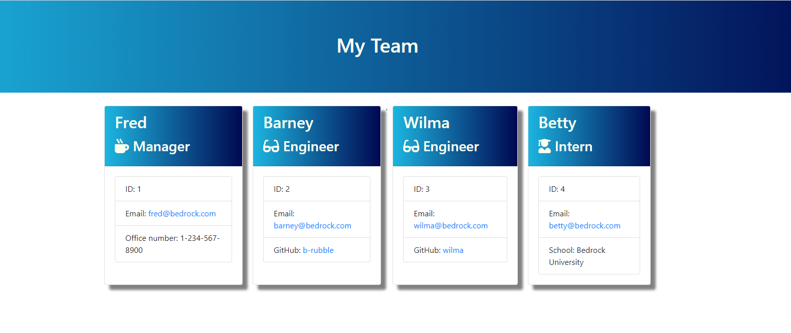

# Team Profile Generator

  ## Table of Contests
  -[Description](#description)
  -[Installation](#install)
  -[Usage](#usage)
  -[Licenses](#licenses)
  -[Test](#tests)
  
  
  ## Description
  As a manager
  I want to generate a webpage that displays my team's information
  so that I have quick access to emails and GitHub profiles
  
  ## Install

  npm install
  
  ## Usage
  
  The project generates a `team.html` page in the `output` directory that displays a formatted team roster. Each team member should display the following:

  * Name

  * Role

  * ID

  * Role-specific property (School, link to GitHub profile, or office number)
  
  ## License

  None
  
  ## Test
  
  npm run test 

  ## Screen Shots
  
